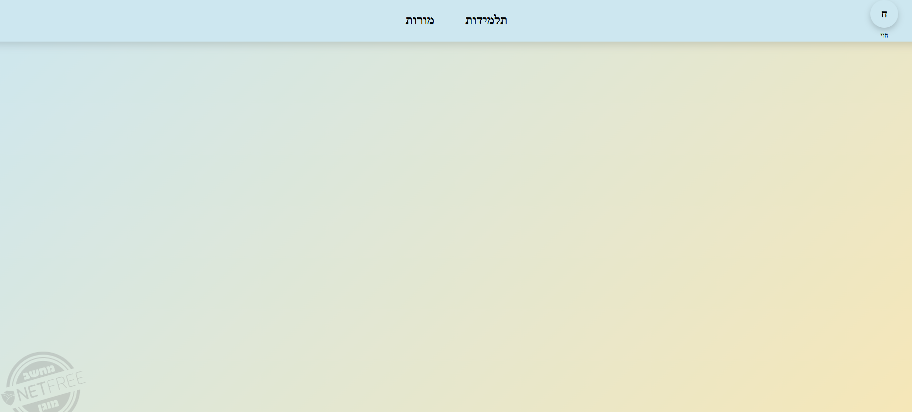
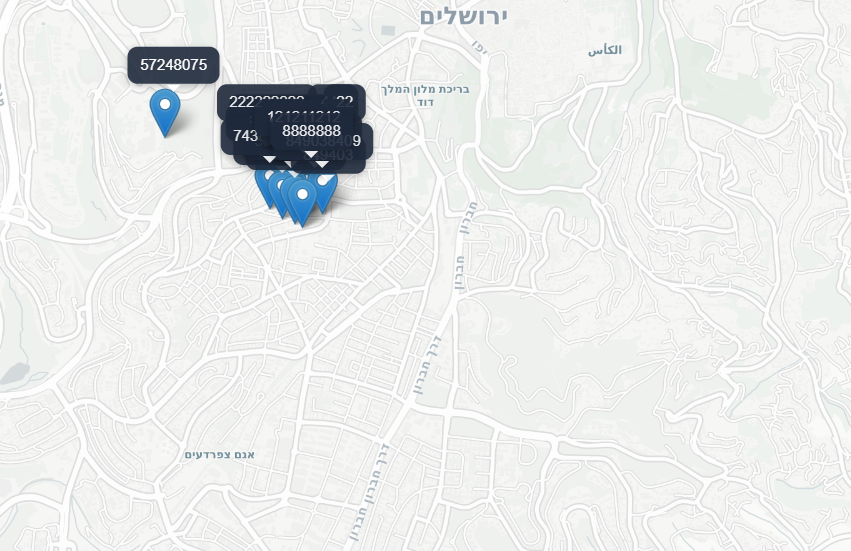

## About The Project

Trip Management & Student Tracking System is a full-stack application designed to manage students and teachers during a trip and track students' locations in real time.

The system includes a web client, a backend API, and a location simulator that continuously sends location updates to the server.

Main capabilities:

* Student registration
* Teacher login (based on ID validation)
* Secure data access for teachers only
* Viewing lists of students and teachers
* Searching for specific students or teachers
* Real-time map displaying student locations
* Live updates using SignalR

---

## Built With

### Frontend

* React
* CSS

### Backend

* ASP.NET Core Web API
* Entity Framework Core
* SignalR

### Map

* Leaflet

### Database

* SQL Server

---

## Project Structure

```bash
TripManagement/
│
├── backend              # Web API server
├── LocationSimulator    # Sends location updates via SignalR
├── frontend             # React frontend
```

---

## Getting Started

### Prerequisites

* Node.js and npm
* .NET SDK
* SQL Server

---

## Installation and Run

### Clone the repository

```bash
git clone https://github.com/chavi-t/TripManagement.git
cd TripManagement
```

---

### Run Backend (API)

```bash
cd TripManagementAPI
dotnet restore
dotnet run
```

The server runs on:

```
https://localhost:7115
```

---

### Run Location Simulator

```bash
cd LocationSimulator
dotnet run
```

This service sends simulated location updates to the server using SignalR.

---

### Run Frontend

```bash
cd client
npm install
npm start
```

---

## API Endpoint

The backend API runs at:
https://localhost:7115

---

## How to Use

1. Open the application (frontend)
2. From the home screen choose:
   - Student Registration
   - Teacher Login
   - View Map

3. Register a new student by filling the form

4. Login as a teacher using an ID number

5. After login:
   - View students list
   - View teachers list
   - Search for specific users

6. Open the map screen to see real-time student locations

---

## Authentication

* Teachers authenticate using their ID number
* The server validates whether the ID belongs to a teacher
* Only authenticated teachers can access system data
* Students do not have access to the data management screens

---

## System Screens

### Home Screen

* Navigation to student registration
* Navigation to teacher login
* Access to the student map


---

### Student Registration

* Form submission with validation
* Success message upon completion


---

### Teacher Login

* Login using ID number


---

### Teacher Dashboard

Includes:

* List of students
* List of teachers
* Search functionality within tables



---

### User Panel

* Teacher’s students list
* Personal details
* Logout

---

### Map View

* Displays all students on a map
* Each student is represented by a marker with their ID
* Locations update continuously in real time
* Implemented using Leaflet and SignalR



---

## External Dependencies

### Backend

* Entity Framework Core
* SignalR

### Frontend

* React
* Leaflet

---

## Assumptions

The following assumptions were made during development:

* The system runs in a local development environment
* Authentication is simplified and based on ID number validation against the server (the server verifies whether the ID belongs to a teacher)
* Location data is generated by a simulator and not real GPS devices
* No advanced authentication or authorization mechanism (such as JWT or role-based access control) is implemented

---

## Future Improvements

* Improve error handling and provide more detailed validation messages
* Integrate real GPS-based location tracking
* Implement a secure authentication mechanism (e.g., JWT-based authentication)
* Add proper authorization and role management
* Enhance real-time communication performance and scalability
* Improve user interface and user experience
* Deploy the system to a cloud environment


---

## Author

Chavi Tarbilo
https://github.com/chavi-t/TripManagement

---

## Notes

This project was developed as part of a technical evaluation process.
